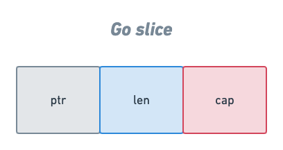

# Hafta 0

**Amaç :** Go programlama dilininin tanıtımı. Gerekli kurulumların gerçekleştirilmesi.

**Yazarlar :** [**Abdullah Bagyapan**](https://github.com/abdullahbagyapan)

## Go Nedir ?

Golang olarakta bilinen Go, açık kaynaklı ve derlenmiş bir programlama dilidir.

Go, programlama verimliliğini artırmak için 2007 yılında Google'da Robert Griesemer, Rob Pike ve Ken Thompson tarafından tasarlandı.

Tasarımında göz önünde bulunan özellikler: statik yazım ve çalışma hızı, okunabilirlik ve kullanılabilirlik, çoklu işlemler için yüksek performans.

> Daha detaylı bilgi için [**Go (programming language)**](https://en.wikipedia.org/wiki/Go_(programming_language)), [**Frequently Asked Questions (FAQ)**](https://go.dev/doc/faq)

## Neden Go Kullanmalıyım ?

Bu bir tercih meselesi. programlama dili yapmak istedikleriniz için bir araçtır. **Sizin için en doğru araç, amacınıza en uygun olan araçtır.**

Go'nun size sağlayacağı birçok avantaj var.

- **Basit** olması.
- Günümüzün problemlerine **çözüm** olarak üretilmesi.
- **Hızlı ve kararlı** olması.
- Açık kaynak olduğu için, **sorun tespitinin ve çözümünün oldukça hızlı olması**.  
- Yardım bulabilmeniz için birçok **topluluğun** (community) olması.

## Go İle Ne Yapabilirim ?

Popülerliği giderek artan Go ile birçok şey yapabilirsiniz.

- Web uygulamaları
- Cloud ve Network servis uygulamaları
- CLI uygulamaları
- Otomasyon uygulamaları

> Daha detaylı bilgi için [**Go Use Cases**](https://go.dev/solutions/use-cases)

## Go Kurulumu

**1 -** Go'nun sitesinden bilgisayarınıza uygun olan setup'ı indirin.
[https://go.dev/dl/](https://go.dev/dl/)


**2 -** İndirilen setup'ı açın.


**3 -** Ardından next next next diyerek kurulumu tamamlayın :) ..


**4 -** Ve yükleme işlemi tamamlandı.


## Go 101

Go 101, Go dilinin temel pratiklerini içeren örnekleri anlatır.

### Bölümler

- Değişkenler
- Array
- Slice
- Map
- String
- Döngüler
- Struct
- Pointer
- Fonksiyonlar
- Errors
- Interfaces
- Modules


### Değişkenler

Go dilinde farklı şekillerde değişken tanımı yapılabilir.


#### *Var* kullanarak

```go
var name string

func main() {
    var sayi = 1
    var pau = "siber"
    var go = "lang"
}
```

#### *Const* kullanarak

```go
const PI = 3.14

func main() {
    PI = 3  // değiştirilemez (immutable)
}
```

#### ":=" operatörü kullanarak

Herhangi bir *tip* tanımlaması yapmak zorunda kalmadan değişken tanımlanabilir.

> Not: Fonksiyonların dışında **kullanılamaz**.

```go
func main() {
    name := "GO PAUSIBER"
}
```

#### Çoklu tanımlama

Birden fazla değişken tanımlanmak istendiği zaman kullanılır.

```go
var(
    id  int
    name string
)

const(
    PI      float = 3.14
    GRAVITY float = 9.8
)
```

### Array

```go
var arr_3 [3]int
var arr_5 = [5]int{1, 2, 3, 4, 5}
```

#### 'make()' fonksiyonu kullanarak

```go
func main() {
	arr_6 := make([]int, 6)
}
```

#### Değer atama

```go
arr_6[0] = 10
```

### Slice

Slicelar temelde arrayler ile aynılardır ancak arraylerden <b>daha etkili ve esnek</b> bir veri tipleridir.

```go
var slice []int
```

veya:

```go
slice := make([]int,5)
```

#### Slice'ın yapısı

Slicelar temelde 3 farklı yapıdan oluşur:

- `ptr` - arrayi tutan işaretçi(*pointer*).
- `len` - slice'in uzunluğu - slice'daki eleman sayısı.
- `cap` - slice'in kapasitesi - işaretçide tutulan arrayin uzunluğu, ayrıca slice'in maksimum uzunluğu.



#### Değer atama

Slicelarda değer eklerken arraylerden farklı olarak `append()` fonksiyonu kullanılır.

```go
slice := make([]int,5)

slice = append(slice,10) // slice'a 10 değerini ekleme
```

### Map

Mapler `key:value` şeklinde değer tutan veri tipleridir.


```go
var map_1 map[int]string
```

Go'da mapler referans tutuculardır, ve `map_1` değişkeni ise daha referans atanmadığı için `nil`dir.
Eğer map tanımlaması yapılacaksa doğru olan `make()` fonksiyonu ile kullanılmasıdır.

```go
map_2 = make(map[string]int)
```

> Daha fazla bilgiye [buradan](https://go.dev/blog/maps) ulaşabilirsiniz

#### Değer atama

```go
map_1 := make(map[string]int)

map_1["test"] = 1
```

#### Değer silme

Maplerde değer silme işlemi `delete()` fonksiyonu ile yapılır.

```go
delete(map_1, 2)
```

#### Değer kontrol etme

```go
name, exists := names[0]    // exists: bool tipinde bir değişkendir
```