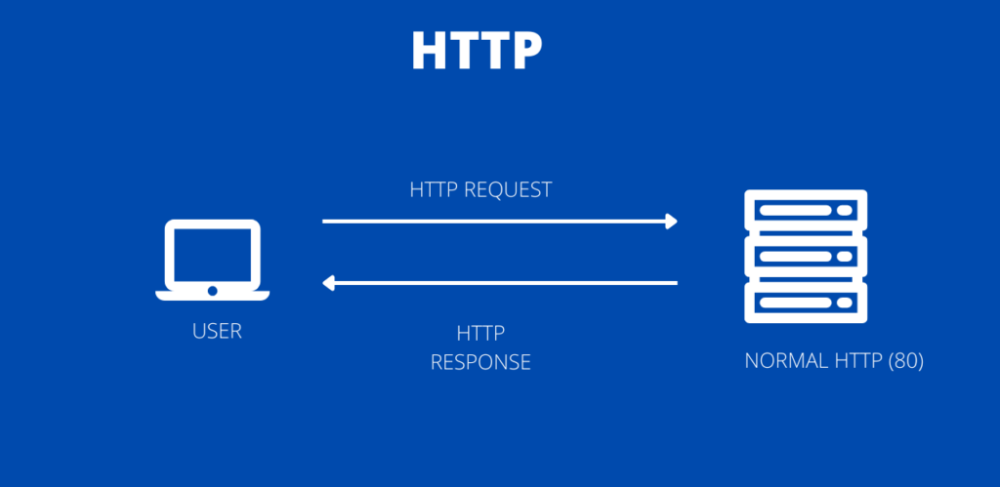
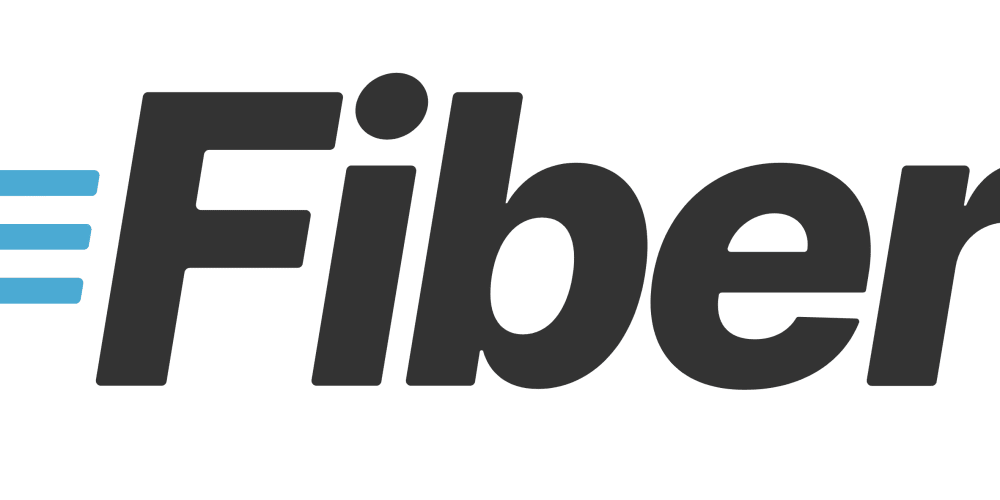
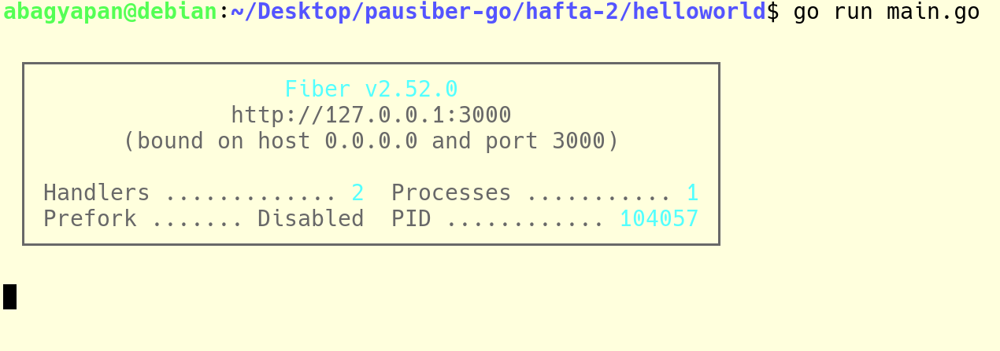
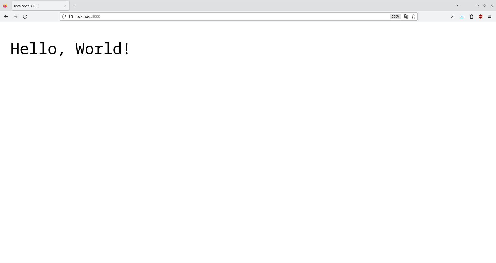

# Hafta 1

**Amaç :** Go ile web uygulaması yapılması.

**Yazarlar :** [**Abdullah Bagyapan**](https://github.com/abdullahbagyapan)

## Web Nedir ?

Web, internet üzerinden içerik paylaşımına olanak tanıyan bir bilgi sistemidir. Hypertext Transfer Protocol'un (HTTP) belirli kurallarına göre web kaynaklarına İnternet üzerinden erişilmesini sağlar.

## HTTP Nedir ?

HTTP, ağa bağlı cihazlar arasında bilgi aktarmak için tasarlanmış bir uygulama katmanı protokolüdür.

HTTP protokolü client-server mimarisinde çalışır. Client (istemci) tarafından request (istek) gönderilir ve server tarafından response (cevap) alınır.



## Client Nedir ?

İstemci, bir sunucu tarafından sağlanan bir hizmete erişim isteyen herhangi bir bilgisayar donanımı veya yazılım aygıtıdır.

## Server Nedir ?

Server (Sunucu), istemcilerin (kullanıcıların) erişebileceği, kullanımına ve paylaşımına açık kaynakları veya bazı servisleri (E-Posta, Web Sitesi) çalıştıran bilgisayar birimlerine verilen genel bir addır.

### Server Türleri

**File Server** (Dosya Sunucusu): Kullanıcıların ortak kullandıkları dosyaların bulunduğu sunucu bilgisayara verilen isimdir. 

**Database Server** (Veri tabanı Sunucusu): Veri tabanı hizmetleri vermek için oluşturulan sunuculardır.

**Web Server** (Web Site Sunucusu): İnternet üzerinde bulunan web sayfalarından sorumludur.

**SMTP Server** (SMTP Sunucusu) : *Simple Mail Transfer Protocol* yani basit Mail transfer protokolu olan servis tüm mail işlemlerinden sorumludur.

## Web Server Yapalım

Kullacağımız kütüphane: [Go Fiber](https://gofiber.io/)



### `main.go` Dosyamızı Oluşturalım

```go
package main


func main() {

}
```

### Modül Dosyamızı Oluşturalım

```
go mod init helloworld
```

### Go Fiber Kütüphanesini İndirelim

```
go get github.com/gofiber/fiber/v2
```

### Artık Kod Yazmanın Vakti

```go
package main

import (
	"github.com/gofiber/fiber/v2"
)

func main() {
	app := fiber.New()

	app.Get("/", func(c *fiber.Ctx) error {
		return c.SendString("Hello, World!")
	})

	app.Listen(":3000")
}
```

### Programımızı Çalıştıralım

```
go run main.go
```



Eğer tarayıcı üzerinden `localhost:3000` adresine gidersek:



Tadaa !!!